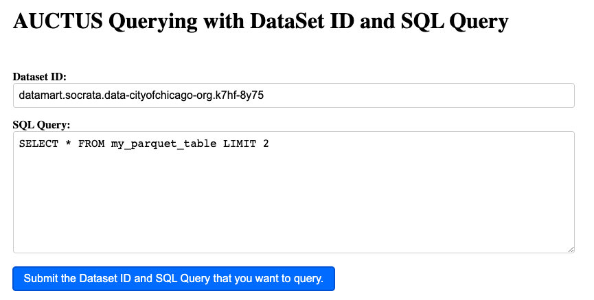

# Querying Structured Data in Dataset Search Engines

**This project aims to improve the functionality of dataset search engines by allowing users to query the contents of discovered datasets. While current search engines enable users to query metadata associated with datasets, this may not provide enough information to determine if a dataset is suitable for their needs.**

To address this limitation, the project proposes developing infrastructure to support queries over datasets stored in a file system or scalable object stoaage backends using MinIO. 

## Features

The proposed methodology involves several steps to enable users to execute SQL queries over the contents of discovered datasets:

- Dataset conversion: The first step involves converting dis- covered datasets to Parquet files to improve query perfor- mance and reduce storage costs. To achieve this, the project will utilize PyArrow and Pandas libraries to read the datasets in CSV format, create a PyArrow table from the dataframe, and write the table to a Parquet file.

-  Object storage: The Parquet files will be stored in an open- source object store using the Minio Python. Minio is a high- performance, distributed object storage system that is com- patible with MinIO object store. The Minio server will be assumed to be running on ”localhost:9000”, and the access key and secret key will be hardcoded.

- User interface modification: The Auctus codebase will be modified to enable users to execute SQL queries over the Parquet files stored in the S3 object store using the DuckDB Python wrapper. The modifications will involve modifying the user interface to allow users to query the stored Parquet files using the DuckDB database engine.

- Query execution: The modified Auctus codebase will query the Parquet files using the DuckDB Python wrapper. DuckDB is a SQL database engine that is designed to work with flat files, including Parquet files. The codebase will uti- lize the DuckDB Python library to execute SQL queries over the Parquet files stored in the S3 object store.

- Performance evaluation: The performance of the modified Auctus codebase will be evaluated by measuring the query response time and comparing it to the response time of exe- cuting the same query on the CSV version of the dataset.
The proposed methodology will leverage PyArrow, Pan- das, Flask, DuckDB Python libraries, and Minio to achieve its objectives. The success of this methodology will enable

Instructions to Reproduce the code base:

- First start by cloning the entire repository and install all the necessary fraeworks like npm, Flask, minIO, DuckDB to get started and you can also download all the dependencies from the Auctus folder as well as the Querying folder.
  -  git clone 

- There are main 2 servers that has to be hosted for making the entire data pipeline work. The Auctus folder has the frontend part and this can be started using:
  -  npm start
- We also need to setup MinIO, by first installing the MinIO client, and then based on your sytem, you need to set MinIO and create a bucket to store all the converted parquet files.

- Next step after setting up the MinIO, you should have the docker containers runnung by going into the auctus folder and then following the below commands:
  
$ docker-compose build --build-arg version=$(git describe) apiserver
Start the base containers
$ docker-compose up -d elasticsearch rabbitmq redis minio lazo
These will take a few seconds to get up and running. Then you can start the other components:

$ docker-compose up -d cache-cleaner coordinator profiler apiserver apilb frontend
You can use the --scale option to start more profiler or apiserver containers, for example:

$ docker-compose up -d --scale profiler=4 --scale apiserver=8 cache-cleaner coordinator profiler apiserver apilb frontend

Ports:
The web interface is at http://localhost:8001

The API at http://localhost:8002/api/v1 (behind HAProxy)

Elasticsearch is at http://localhost:8020

Import a snapshot of our index (optional):
$ scripts/docker_import_snapshot.sh - This will download an Elasticsearch dump from auctus.vida-nyu.org and import it into your local Elasticsearch container.

- To start the backend server, start by running the .py file:
  -  python3 main.py

The main Auctus Interface is hosted on: localhost:3001
The Backend We server will be hosted on: http://127.0.0.1:5000

- Workflow: When the user selects a dataset and want's to query that dataset, that user can click on the SQL Query command, where it gets redirected into another page with a New Frontend where the user has the ability to enter the SQL commands. After hitting the submit button, the user can view the results in that same user Interface, where the results will be well formatted in the form of a dataframe(Rows and Columns).

## Related Work:

In this work, we compared the performance of Parquet and CSV file formats using two popular libraries, Pandas and DuckDB. Our experiments showed that Pandas took 0.29 seconds to read the Parquet file, while it took 0.618 seconds to read the CSV file. On the other hand, DuckDB took 0.026 seconds to read the Parquet file. These results suggest that Parquet file format is more efficient than CSV file format for data analysis tasks, and DuckDB provides better perfor- mance than Pandas for reading Parquet files.
